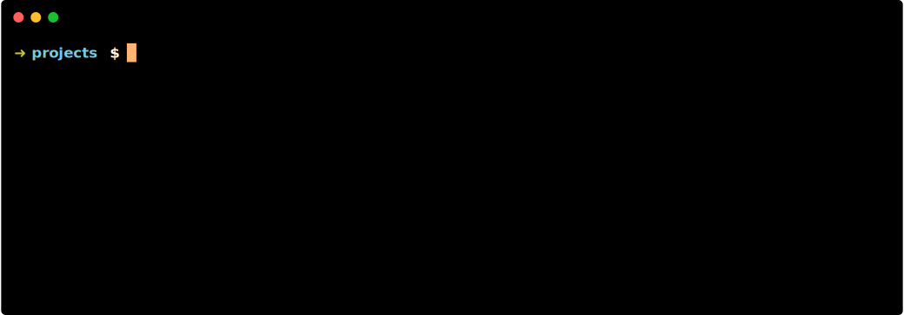
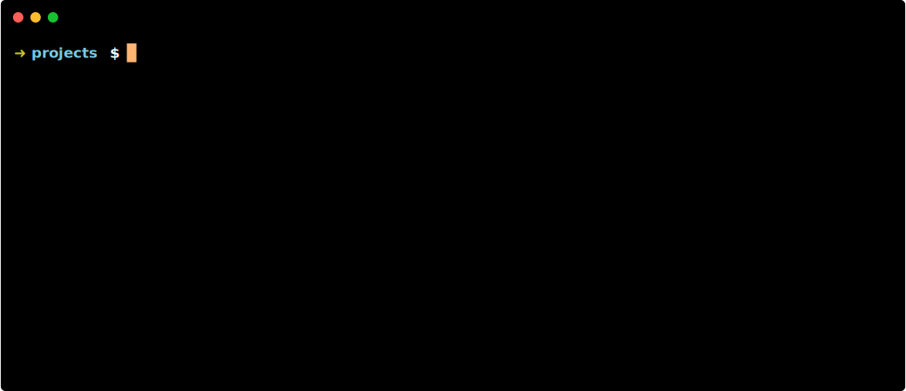

### the missing macOS app notarization helper, built with Rust

# About

[Notarizing a macOS app](https://developer.apple.com/documentation/xcode/notarizing_macos_software_before_distribution) involves a series of manual steps, including zipping the bundle, uploading it to to Apple, and polling the notarization service.

`xcnotary` automates these steps for you. It:

- Attempts to fail fast if necessary, performing several checks on your application bundle before uploading it to Apple.
- Compresses and submits the bundle to the notarization service.
- Polls the service until completion. This step typically takes a few minutes.
- In case of success, attaches the notarization ticket to the bundle, enabling the app to pass Gatekeeper on first run even without an Internet connection.
- In case of failure, fetches the error log from Apple and outputs it to `stderr`.
- Return a zero/non-zero code for easy CI integration.



*Screencap sped up for brevity. The service takes several minutes to notarize your upload.*

# Installation

### Homebrew

```
brew install akeru-inc/tap/xcnotary
```

# Usage

```
xcnotary \
  -d <Apple Developer account> \
  -k <keychain item for Apple Developer account password, see below> \
  -b <bundle path>
```

### Specifying the password keychain item

This tool does not handle your Apple Developer password. Instead, Xcode's helper `altool` reads an app-specific Apple Developer ID password directly from the keychain. See [the documentation](https://developer.apple.com/documentation/xcode/notarizing_macos_software_before_distribution/customizing_the_notarization_workflow#3087734) for `xcrun altool --store-password-in-keychain-item` to set up a suitable keychain item.

### Required network access

- Xcode's `altool` will connect to several Apple hosts as outlined in [the documentation](https://developer.apple.com/documentation/xcode/notarizing_macos_software_before_distribution/customizing_the_notarization_workflow).

- When notarization fails, `xcnotary` will connect to `https://osxapps-ssl.itunes.apple.com/` on port 443 to retrieve the failure log.

# Bundle pre-checks

`xcnotary` attempts to check your bundle for some [common notarization issues](https://developer.apple.com/documentation/xcode/notarizing_macos_software_before_distribution/resolving_common_notarization_issues) before uploading it to Apple. While not foolproof, these checks may potentially save you minutes waiting for a response only to fail due to an incorrect code signing flag.



The following checks are currently performed:

- [x] Bundle being signed with a Developer ID certificate and not containing unsigned items.
- [x] Bundle being signed with a secure timestamp.
- [x] Bundle *not* having the get-task-allow entitlement.
- [x] Bundle having hardened runtime enabled.

# Building a notarization-friendly bundle

Following is a working example that sets various necessary build flags, such as code signing with a "secure timestamp":

```sh
xcodebuild \
   -target <target> \
   -scheme <scheme> \
   -configuration Release \
   -derivedDataPath .xcodebuild \
   "CODE_SIGN_IDENTITY=Developer ID Application: <team name>" \
   "OTHER_CODE_SIGN_FLAGS=--timestamp --options=runtime" \
   CODE_SIGN_INJECT_BASE_ENTITLEMENTS=NO \
   CODE_SIGN_STYLE=Manual
```

`CODE_SIGN_IDENTITY` should match the corresponding Keychain certificate.

Note that `--options=runtime` will have the effect of opting in your binary to the hardened runtime environment. You most likely want to first manually enable the "Hardened Runtime" capability in Xcode's target settings > "Signing and Capabilities" and make sure your application functions as expected. There, you may also add any entitlements to relax the runtime restrictions.

# Contact

Feature requests/comments/questions? Write: david@akeru.com
